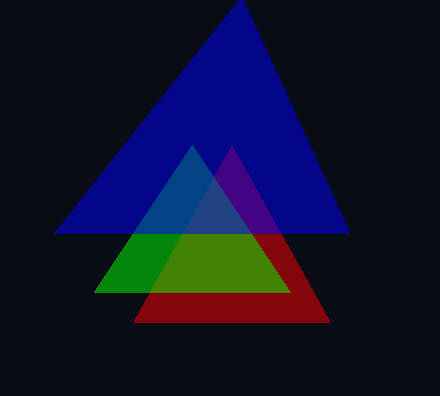
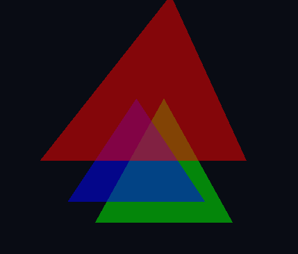

# Assignment 1 - TDT4195 - Nicolai H. Brand

## 1

### c

## 2

### a

1. This is called clipping
2. Clipping occurs when parts of an object scene lays outside the clip box i.e outside of the specified regions for renderin.
3. The purpose of clipping is to not draw that which is outside the visible area. First of all this ensures correctness, but also helps with performance as that which should not be visible will not be considered in the latter stages of the pipeline.

### b

I will use the same triangle as above, changing the indices from `[0, 1, 2]` to `[2, 1, 0]`.

1. The triangle is no longer visible.
2. While not complety sure, I belivie this has something to do with winding order and culling. In OpenGL the default winding order is counterclockwise. Since I have now specified the indices in clockwise order, I would expect to see the back-face of the triangle. However, by default, OpenGL "culls" (does not draw) the back faces of polygons. This is because it considers the triangle to be a back-face meaning it does not face the "camera" and has no use being drawn.
3. A triangle will not be rendered if it is considered a back face (vertices ordered clockwise) AND face culling is enabled.

### c

1. The depth buffer neads to be cleared on each frame because scenes can change and keeping the old frame buffer may result in incorrect depth information. An easy example is to consider an object which dissapears the next frame. If the frame buffer is not cleared, any object that used to be behind the now dissapeared object would still not be visible. If we were watching a sphere moving leftwards without clearing the depth buffer, the sphere would appear to leave behind ghosts of itself as the previous depths may block certain pixels of the sphere from being shown.
2. The Fragment Shader is executed for every fragment. A fragment is a potential pixel. We can have an example where two fragments occupy the same resulting pixel (overlapping geometry). In this case, the Fragment Shader would run for both the fragments, or both the potentials for the same pixel, resulting in multiple Fragment Shader executions for the same pixel.
3. Vertex and Fragment shaders. In short, the Vertex shader is responsible for transforming the vertex data (for example position) from object space to screen space. The Fragment shader on the other hand processes each individual fragment (potential pixel, as mentioned earlier) and determine the final color of the potential pixel to be shown on the screen. Theres more to these shaders, but these are the basic ideas.
4. Using indexing can save a lot of memory. This is because the same vertices tend to be used across multiple triangles, and having to duplicate the vertices would be terribly inneficient.
5. The final parameter shall be a pointer to the first component of the vertex buffer. Passing NULL tells OpenGl to point to the first component of the bound VBO. However, if we are not using a VBO we would have to provide the pointer ourselves. I am unsure why exactly you would not want to use a VBO. One potential reason is if the buffer data changes often. Since the VBO is sent to the GPU, for a situation where the VBO changes very frequently, this may result in an extraordinary amount of data transfer to the GPU.

### d

1. I created a new Vertex shader which simply flips the X and Y coordinates of the incoming position of the object. See `shaders/flip.vert`.

2. I created a new Fragment shader where the color vector have different values that correspond to a purple-ish color. See `shaders/cool.frag`.

## 3

